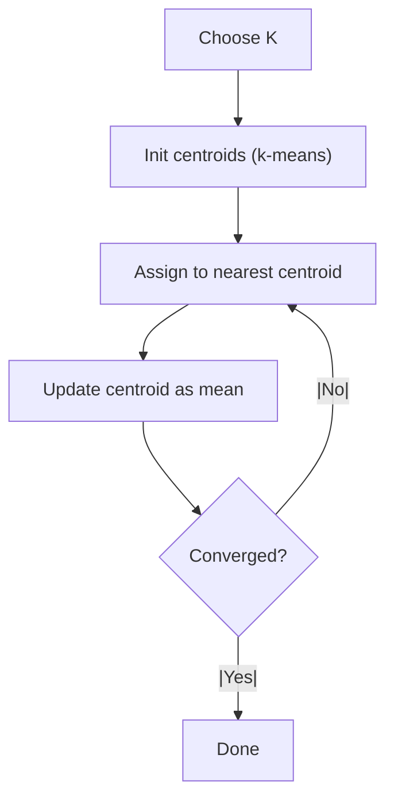

# ⭐ K-Means Clustering

Make clusters of similar points by iteratively assigning points to the nearest centroid and updating centroids as their mean. Fast, simple, and surprisingly effective when used with care.

---

## 🎯 Overview

- K-Means is an **unsupervised clustering algorithm** that partitions data into **K clusters**.
- Goal: minimize the **sum of squared distances** from points to their assigned cluster centroids.
- Assumes: continuous features and roughly spherical, equally sized clusters.

> Quick intuition: “Pull” points toward K moving centers until nobody wants to switch teams.

---

## 🧠 Intuition First

1) Pick K starting centroids (preferably smartly).
2) Assign each point to the nearest centroid.
3) Recompute each centroid as the **mean** of its assigned points.
4) Repeat steps 2–3 until assignments stop changing.




---

## 🧩 Algorithm (Step-by-Step)

1. Choose `K` (try multiple values; see “Choosing K”).
2. Initialize centroids (use **k-means++**).
3. Assignment: for each point, find nearest centroid (usually Euclidean).
4. Update: recompute each centroid as the mean of its cluster.
5. Repeat 3–4 until convergence (or `max_iter` reached).

---

## 📐 Math Essentials

Objective minimized by K-Means (SSE):

$$
J = \sum_{k=1}^K \sum_{x_i \in C_k} \lVert x_i - \mu_k \rVert^2
$$

Centroid update rule:

$$
\mu_k = \frac{1}{|C_k|} \sum_{x_i \in C_k} x_i
$$

Common distance (Euclidean):

$$
d(x, \mu) = \sqrt{\sum_{j=1}^{d} (x_j - \mu_j)^2}
$$

---

## 🛫 Initialization (Why k-means++ wins)

- Random init can trap you in poor local minima.
- **k-means++** picks spread-out starting points:
  1) Choose one point uniformly at random.
  2) Choose next points with probability proportional to squared distance from the nearest chosen centroid.
  3) Run standard K-Means.

Benefits: better solutions, faster convergence, fewer retries needed.

---

## 📏 Choosing K

- **Elbow Method**: plot `K` vs `inertia_` (SSE). Look for the “elbow”.
- **Silhouette Score**: average separation from other clusters, in [−1, 1]; higher is better.
- **Gap Statistic**: compare SSE to a reference (uniform) distribution.

> Tip: Validate with more than one method when possible.

---

## 🧪 Evaluation Metrics

- **Internal**: `inertia_` (SSE), **Silhouette**, **Calinski–Harabasz**, **Davies–Bouldin**.
- **External** (need labels): **ARI**, **NMI**, **F1**.
- **Visual**: PCA/UMAP to 2D, color by cluster.

---

## 🧰 Practical Checklist

- [ ] Scale features (`StandardScaler`/`MinMaxScaler`) before K-Means.
- [ ] Use `init="k-means++"` and multiple starts (`n_init>=10` or `'auto'`).
- [ ] Try a small range of `K` (e.g., 2–10) with elbow + silhouette.
- [ ] Set `random_state` for reproducibility.
- [ ] Remove/clip outliers or use robust scaling.
- [ ] Inspect clusters (feature means, sizes) and visualize in 2D.

---

## ⚙️ Complexity & Convergence

- Per iteration: ~`O(n × K × d)`, total ~`O(n × K × d × t)` where `t` is iterations.
- Converges to a local optimum; multiple restarts help.

---

## 🔀 Variants & Alternatives

- **MiniBatchKMeans**: faster on large data using small random batches.
- **K-Medoids (PAM)**: uses medoids; more robust to outliers.
- **GMM (EM)**: soft clustering with Gaussian components.
- **Spectral Clustering/DBSCAN/HDBSCAN**: handle non-convex shapes.

---

## 🧪 Pseudocode

```text
Input: K, data X
1. Initialize centroids μ1 ... μK (k-means++)
2. repeat
3.     Assign each xi to nearest μk
4.     For each cluster Ck, set μk = mean(Ck)
5. until assignments (or μk) stop changing or max_iter reached
```

---

## 🖥️ Python: Ready-to-Use Snippets

Minimal, scalable pipeline with scaling + k-means++:

```python
import numpy as np
from sklearn.preprocessing import StandardScaler
from sklearn.cluster import KMeans

# X: ndarray of shape (n_samples, n_features)
X_scaled = StandardScaler().fit_transform(X)

kmeans = KMeans(
    n_clusters=3,
    init="k-means++",
    n_init=10,          # or 'auto' on newer scikit-learn
    max_iter=300,
    random_state=42,
)
labels = kmeans.fit_predict(X_scaled)
centroids = kmeans.cluster_centers_
inertia = kmeans.inertia_
```

Elbow curve (K vs SSE):

```python
import numpy as np
import matplotlib.pyplot as plt
from sklearn.cluster import KMeans
from sklearn.preprocessing import StandardScaler

X_scaled = StandardScaler().fit_transform(X)
Ks = range(1, 11)
inertias = []
for k in Ks:
    km = KMeans(n_clusters=k, init="k-means++", n_init=10, random_state=42)
    km.fit(X_scaled)
    inertias.append(km.inertia_)

plt.plot(Ks, inertias, marker="o")
plt.xlabel("K")
plt.ylabel("SSE (inertia)")
plt.title("Elbow Method")
plt.grid(True)
plt.show()
```

Silhouette score:

```python
from sklearn.metrics import silhouette_score

best_score = -1
best_k = None
for k in range(2, 11):
    km = KMeans(n_clusters=k, init="k-means++", n_init=10, random_state=42)
    labels = km.fit_predict(X_scaled)
    score = silhouette_score(X_scaled, labels)
    if score > best_score:
        best_score, best_k = score, k
print(f"Best K={best_k} with silhouette={best_score:.3f}")
```

---

## 🧵 Use Cases

- Customer segmentation, churn/risk grouping
- Image compression (color quantization)
- Topic clustering of embeddings
- Market basket/behavior segmentation

---

## ⚠️ Limitations (Know before you go)

- Must choose **K** ahead of time.
- Sensitive to **outliers** and **feature scaling**.
- Prefers **spherical, equally-sized** clusters; struggles with non-convex shapes.
- Local minima; initialization matters (use k-means++ and multiple starts).

---
## Youtube 📽️
<p>
    <a href="https://www.youtube.com/watch?v=4b5d3muPQmA">Stats Quest Video 😁</a>
    
</p>

---

## ✅ At-a-Glance Summary

K-Means is fast and powerful for well-scaled, numeric data with roughly spherical clusters. Choose K thoughtfully (elbow + silhouette), initialize with k-means++, and always scale your features. For massive datasets, try MiniBatchKMeans; for non-convex shapes or heavy outliers, consider alternatives.

---
